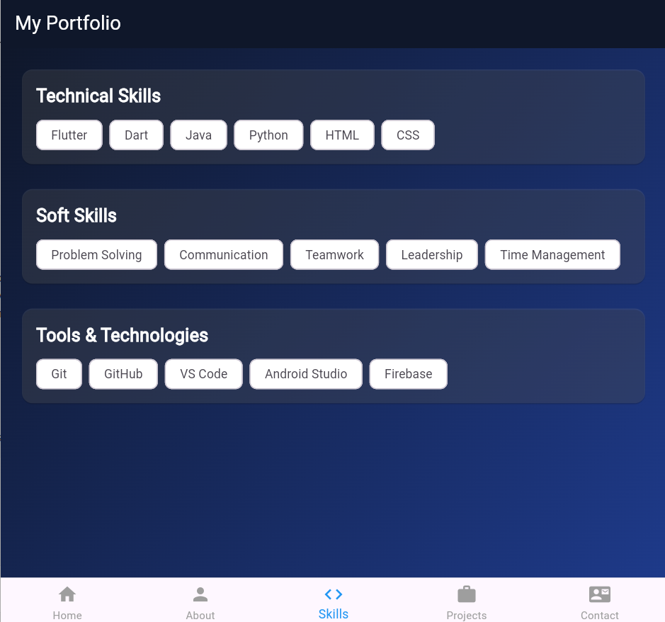
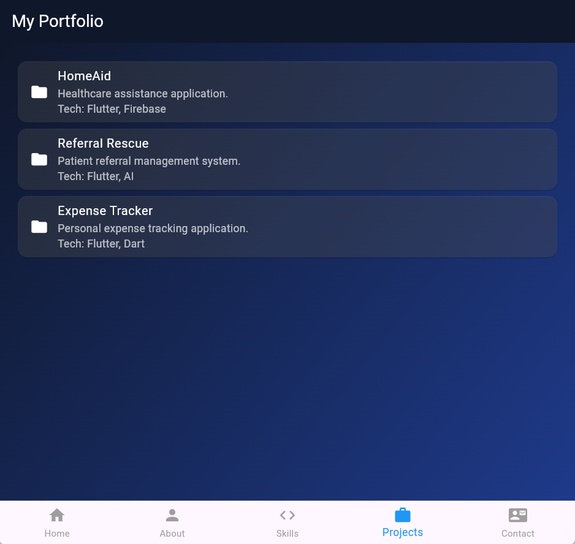

# Personal Portfolio App

A Flutter-based Personal Portfolio Mobile Application that showcases my profile, skills, projects, and contact information through a modern and responsive user interface.

## Project Overview

This application serves as a digital portfolio that presents my profile, skills, projects, and contact information. It demonstrates Flutter UI development, navigation, reusable widgets, and responsive mobile design.

## Features Implemented

- Home screen with profile picture, name, professional title, and introduction.
- About Me screen with educational background, career objective, and hobbies.
- Skills screen with:
  - Technical Skills
  - Soft Skills
  - Tools & Technologies
- Projects screen displaying completed projects and technologies used.
- Contact screen with Email, Phone, LinkedIn, and GitHub details.
- Bottom Navigation Bar for smooth navigation.
- Modern dark blue gradient UI across all screens.

## Technologies Used

- Flutter
- Dart
- Material Design
- Visual Studio Code
- Git & GitHub

## Installation Steps

1. Clone the repository.

   ```bash
   git clone https://github.com/KirthikSatyamoorthy/Personal-Portfolio-App.git
   ```

2. Open the project folder.

   ```bash
   cd Personal-Portfolio-App
   ```

3. Install dependencies.

   ```bash
   flutter pub get
   ```

4. Run the application.

   ```bash
   flutter run -d chrome
   ```

## Project Structure

```text
lib/
│── main.dart
└── screens/
    │── home_screen.dart
    │── about_screen.dart
    │── skills_screen.dart
    │── projects_screen.dart
    └── contact_screen.dart

assets/
└── screenshots/
    │── home.png
    │── about.png
    │── skills.png
    │── projects.png
    └── contact.png
```

## Screenshots of the Application

### Home Screen


### About Screen


### Skills Screen



### Projects Screen



### Contact Screen


## Author

**Kirthik Satyamoorthy**

- GitHub: https://github.com/KirthikSatyamoorthy